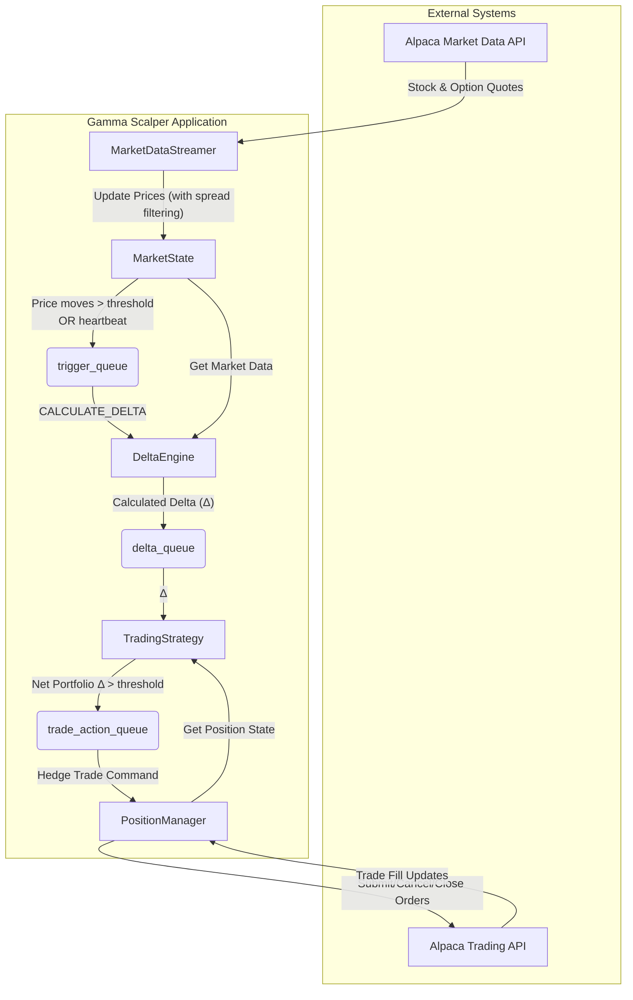

# Gamma Scalper: An Automated Market-Neutral Options Strategy

This project provides a reference implementation of an automated [Gamma Scalping strategy](https://alpaca.markets/learn/gamma-scalping) using the Alpaca Trading API. It's designed to be a flexible and technically sound example for traders and developers interested in exploring market-neutral options strategies.

Our goal is to make complex concepts accessible. If you're new to options, this guide will walk you through the core ideas. If you're an experienced trader, you'll find a configurable engine to build upon.

---

## The Core Concept: A Race Against Time

So, what is Gamma Scalping? Imagine you want to profit from a stock's price movements without betting on its direction. That's what this strategy aims to do. This strategy is long volatility, meaning it profits if the stock is *more* volatile than the market expects.  At its heart, it's a race between two competing forces:

1.  **Volatility (Your Profit Engine - Gamma):** We begin by buying a "straddle" (a call and a put at the same strike) to get positive **Gamma**, which makes our position benefit from movement in either direction. We then convert volatility into profit by "scalping": repeatedly buying and selling the underlying stock as it fluctuates. 

2.  **Time Decay (Your Cost - Theta):** The options we buy allow us to scalp the underlying while reducing exposure to directional risk. A daily cost is incurred. Every day that passes, the value of our options decreases slightly. This steady loss in value is called **Theta**.

**The goal is to make more money from scalping the small price fluctuations (harvesting volatility) than we lose to time decay.** We are making a bet that the *realized volatility* of the asset will be greater than the *implied volatility* priced into the options.

---

## System Architecture

The application is built using Python's `asyncio` framework. Components are decoupled and communicate via queues, which can create a scalable architecture. The system is designed to calculate delta only when necessary, helping optimize performance during high-volume data periods.



### Key Components

*   **Market Data & State (`market/state.py`):** Subscribes to real-time Alpaca data streams for the stock and its options. To avoid acting on illiquid or "bad" quotes, it maintains a moving average of the bid-ask spread and rejects any incoming quote with a spread that's significantly wider than this average.
*   **The Calculation Core (`engine/delta_engine.py`):** This is where the heavy lifting happens. Triggered only when the stock price moves significantly, it uses the industry-standard `QuantLib` library to calculate option Greeks.
    *   It uses a **binomial tree pricing model** (Cox-Ross-Rubinstein), necessary for accurately valuing American-style options with the potential for early exercise.
    *   It takes market prices as input and first performs a self-consistency check to **back-solve for implied volatility**. It then uses this fresh, real-world volatility to compute the Greeks (Delta, Theta, and Gamma).
    *   ⚠️ Note: The current implementation uses a continuous approximation for the dividend yield. While this is convenient for modeling, it can produce inaccurate risk metrics if a dividend is expected soon. For greater accuracy—especially near dividend dates—a discrete yield model should be used.
*   **The Decision Maker (`strategy/hedging_strategy.py`):** This component has one job: ingest the calculated delta from a queue and decide if a hedge is necessary. It compares the portfolio's net delta to a configurable "dead band" (`HEDGING_DELTA_THRESHOLD`). If the delta has strayed too far from neutral, it emits a trade command to rebalance.
*   **The Executor (`portfolio/position_manager.py`):** This is the execution layer. It takes trade commands and handles all interaction with the Alpaca API. It contains important logic to manage how orders are submitted, to avoid placing new orders that conflict with existing ones (using locks) and correctly handling trades that cross from a long to a short position.

---

## Getting Started

### 1. Prerequisites
* Python 3.10+
* An Alpaca paper or live trading account.
* [uv](https://github.com/astral-sh/uv) (for environment and package management)

### 2. Installation

1.  **Install `uv`**

    If you don't have `uv` installed, you can install it with `pip`:
    ```bash
    pip install uv
    ```

2.  **Clone the repository and set up the environment**

    ```bash
    git clone https://github.com/alpacahq/gamma-scalping.git
    cd gamma-scalping

    # Create and activate a virtual environment with uv
    uv venv
    source .venv/bin/activate # On Windows, use `.venv\Scripts\activate`

    # Install the project dependencies
    uv pip install -e .
    ```

### 3. Configuration

Create a `.env` file in the project root by copying the example:

```bash
cp .env.example .env
```

Now, edit the `.env` file with your Alpaca API keys:

```
# .env file
IS_PAPER_TRADING="true"
TRADING_API_KEY="YOUR_PAPER_API_KEY"
TRADING_API_SECRET="YOUR_PAPER_API_SECRET"
```

Next, dive into `config.py` to tune the strategy's behavior.

---

## Configuration Deep Dive (`config.py`)

This is where you can truly make the strategy your own. Here are the key parameters and what they mean:

| Parameter | Default | Description |
| --- | --- | --- |
| `HEDGING_ASSET` | `"SPY"` | The underlying asset to trade. |
| `LOGGING_DIRECTORY` | `"trades"` | Where to save a log of all executed trades for later analysis. |
| `INITIALIZATION_MODE` | `"init"` | `"init"`: Liquidates all existing positions (stock and options) for the asset and starts fresh by finding a new straddle. `"resume"`: Assumes you already have a straddle and syncs with your portfolio to begin hedging immediately. |
| `HEDGING_DELTA_THRESHOLD` | `2.0` | **The most important strategy parameter.** How far can delta drift from zero before we hedge? See the detailed discussion below. |
| `STRATEGY_MULTIPLIER` | `1` | The number of straddles to purchase. This scales the size of your position and subsequent hedges. |
| `MIN_EXPIRATION_DAYS` | `30` | The minimum days to expiration when searching for an options contract. |
| `MAX_EXPIRATION_DAYS` | `90` | The maximum days to expiration. |
| `MIN_OPEN_INTEREST` | `100` | The minimum open interest for an options contract to be considered, ensuring a baseline of liquidity. |
| `THETA_WEIGHT` | `1.0` | A weight to adjust the importance of theta in the straddle scoring function. |
| `DEFAULT_RISK_FREE_RATE` | `0.05` | A fallback risk-free rate. The application first tries to fetch the live rate from the US Treasury yield curve; if that fails, it uses this default. |
| `PRICE_CHANGE_THRESHOLD` | `0.05` | A delta calculation is triggered if the underlying price moves by this amount (in dollars). |
| `HEARTBEAT_TRIGGER_SECONDS` | `5` | In a quiet market, this ensures delta is recalculated at least this often (in seconds). |
| `TRADE_COMMAND_TTL_SECONDS` | `5` | A safety check. If a trade command is older than this when the Position Manager reads it, the command is discarded as stale. |


### The Hedging Delta Threshold Trade-Off

This parameter is the heart of your strategy's performance. It defines how sensitive you are to market movements.

*   **Set it too high:** You will rarely trade ("scalp"). Your failure to capture profits from small fluctuations means your position will likely be slowly eaten away by time decay (theta).
*   **Set it too low:** You will trade constantly. Each trade costs you money by crossing the bid-ask spread, and these transaction costs will overwhelm the small profits from each scalp.

The goal is to find the "Goldilocks" zone: a threshold tight enough to capture real volatility but wide enough to ignore noise and avoid being bled by execution costs.

---

## The Initialization Process: Finding the Straddle for You

When you start the bot in `init` mode, it goes on a hunt for the most "gamma-cheap" straddle. The goal is to find the position that gives you the most profit potential (Gamma) for the lowest cost (Theta + Spread).

It does this by calculating a score for every eligible straddle within your defined expiration window and liquidity constraints:

`Score = (abs(Theta) * THETA_WEIGHT + Transaction Cost) / Gamma`

Theta and Gamma are computed from market prices and the transaction cost is approximated as the sum of the spreads of our two options contracts (essentially the cost of entering and exiting the position with no price change).  The bot calculates this score for all candidates and chooses the one with the **lowest score**. This systematic approach is designed to help identify cost-effective positions.

---

## Running the Bot

Once configured, running the bot is simple:

```bash
python main.py
```

The bot will start, initialize its position (based on your chosen `INITIALIZATION_MODE`), and begin its cycle of monitoring, calculating, and hedging.

---

## A Framework for Your Own Strategies

This project is a powerful engine, but it's not a complete, "fire and forget" system. It has not been stress tested under real market conditions and should be thought of as a foundation for you to build on. Here are some key areas where you can add your own intelligence:

*   **Opportunity Identification:** The bot knows *how* to scalp, but not *when*. A great enhancement would be to integrate a model that predicts future volatility. You could then run the scalper only when you forecast that realized volatility will be higher than the implied volatility priced into the options.

*   **Dynamic Delta Thresholds:** The hedging threshold is currently static. A more advanced system might make it adaptive. For example, you could tighten the threshold when bid-ask spreads are narrow and widen it when they are wide.

*   **Smarter Exit & Risk Management:** The current version doesn't have a defined exit strategy. You could build in logic to:
    *   **Set a stop-loss** to manage risk.
    *   **Exit the position** after a certain amount of time, or when the opportunity decays.
    *   **Detect a strong trend.** A straddle becomes profitable on its own in a strong trend. You might want to stop hedging and let the position run to capture that larger directional profit.
*   **Improved Pricing Models:** The current system uses a binomial tree with a continuous dividend yield approximation. Future versions could explore models with discrete dividend yields for greater accuracy near ex-dividend dates, or even shift to analytic models for faster computation in latency-sensitive environments.
 
---
<div style="font-size: 0.8em;">
Disclosures

Options trading is not suitable for all investors due to its inherent high risk, which can potentially result in significant losses. Please read [Characteristics and Risks of Standardized Options](https://www.theocc.com/company-information/documents-and-archives/options-disclosure-document) before investing in options.

The algorithm’s calculations are based on historical and real-time market data but may not account for all market factors, including sudden price moves, liquidity constraints, or execution delays. Model assumptions, such as volatility estimates and dividend treatments, can impact performance and accuracy. Trades generated by the algorithm are subject to brokerage execution processes, market liquidity, order priority, and timing delays. These factors may cause deviations from expected trade execution prices or times. Users are responsible for monitoring algorithmic activity and understanding the risks involved. Alpaca is not liable for any losses incurred through the use of this system.

The Paper Trading API is offered by AlpacaDB, Inc. and does not require real money or permit a user to transact in real securities in the market. Providing use of the Paper Trading API is not an offer or solicitation to buy or sell securities, securities derivative or futures products of any kind, or any type of trading or investment advice, recommendation or strategy, given or in any manner endorsed by AlpacaDB, Inc. or any AlpacaDB, Inc. affiliate and the information made available through the Paper Trading API is not an offer or solicitation of any kind in any jurisdiction where AlpacaDB, Inc. or any AlpacaDB, Inc. affiliate (collectively, “Alpaca”) is not authorized to do business.

All investments involve risk, and the past performance of a security, or financial product does not guarantee future results or returns. There is no guarantee that any investment strategy will achieve its objectives. Please note that diversification does not ensure a profit, or protect against loss. There is always the potential of losing money when you invest in securities, or other financial products. Investors should consider their investment objectives and risks carefully before investing.

Please note that this article is for general informational purposes only and is believed to be accurate as of the posting date but may be subject to change. The examples above are for illustrative purposes only and should not be considered investment advice. 

Securities brokerage services are provided by Alpaca Securities LLC ("Alpaca Securities"), member [FINRA](https://www.finra.org/)/[SIPC](https://www.sipc.org/), a wholly-owned subsidiary of AlpacaDB, Inc. Technology and services are offered by AlpacaDB, Inc.

This is not an offer, solicitation of an offer, or advice to buy or sell securities or open a brokerage account in any jurisdiction where Alpaca Securities is not registered or licensed, as applicable.
</div>

---
 
## License

This project is licensed under the MIT License. See the [LICENSE](LICENSE) file for details. 

---
